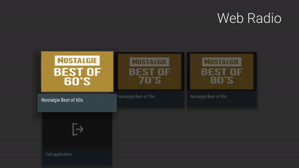

# WebRadio AndroidTV app

[](https://circleci.com/gh/bertrandmartel/webradio-tv-app) 
[](LICENSE.md)

A sample Android TV application used to play webradio streaming



## WebRadio template

This template support multiple streams according to the following template file in `res/raw/grid_example.json` : 

```
{
  "cards": [
    {
      "type": "RADIO_ITEM",
      "title": "Nostalgie Best of 60s",
      "description": "",
      "localImageResource": "http://static.radio.net/images/broadcasts/2d/c7/18490/1/c300.png",
      "stream": "http://cdn.nrjaudio.fm/adwz1/fr/30615/mp3_128.mp3"
    },
    {
      "type": "RADIO_ITEM",
      "title": "Nostalgie Best of 70s",
      "description": "",
      "localImageResource": "http://static.radio.net/images/broadcasts/30/41/8111/1/c300.png",
      "stream": "http://cdn.nrjaudio.fm/adwz1/fr/30613/mp3_128.mp3"
    },
    {
      "type": "RADIO_ITEM",
      "title": "Nostalgie Best of 80s",
      "description": "",
      "localImageResource": "http://static.radio.net/images/broadcasts/15/bc/12368/1/c300.png",
      "stream": "http://cdn.nrjaudio.fm/adwz1/fr/30605/mp3_128.mp3"
    },
    {
      "type": "EXIT_ITEM",
      "title": "Exit application",
      "description": "",
      "localImageResource": "exit"
    }
  ]
}
```

`localImageResource` refer to an external image displayed when user click on the webradio card in the gridview

## External libraries

* [leanback-v17](https://developer.android.com/reference/android/support/v17/leanback/package-summary.html)
* [gson](https://github.com/google/gson)
* [picasso](https://github.com/square/picasso)

## License

The MIT License (MIT) Copyright (c) 2017 Bertrand Martel
